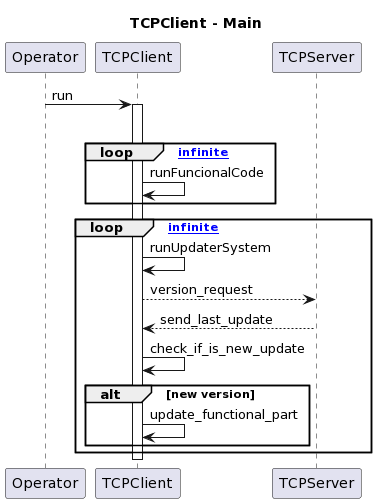
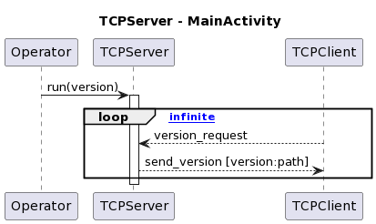
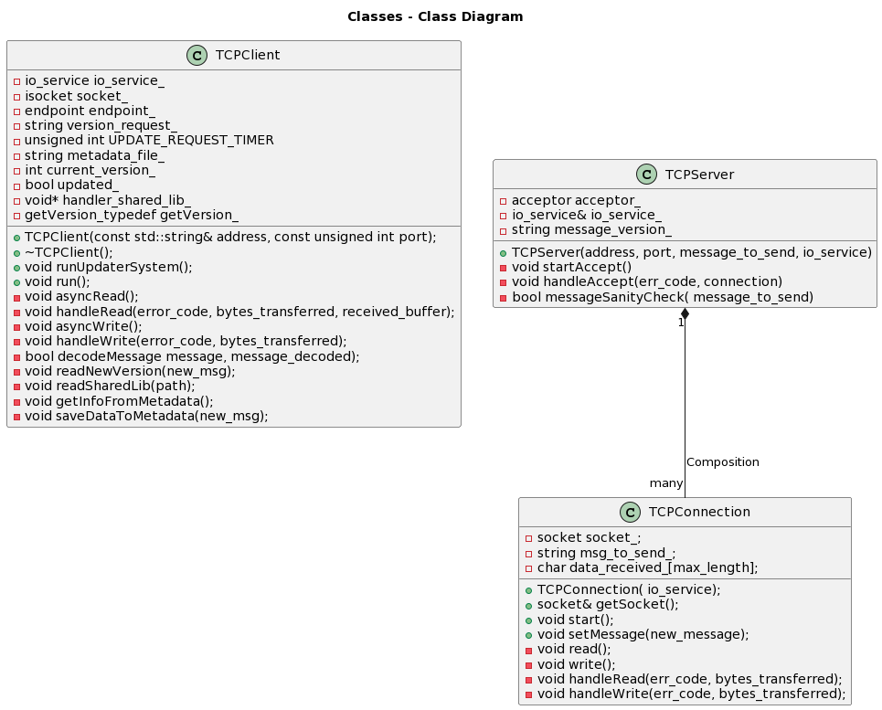
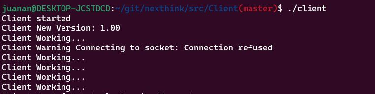
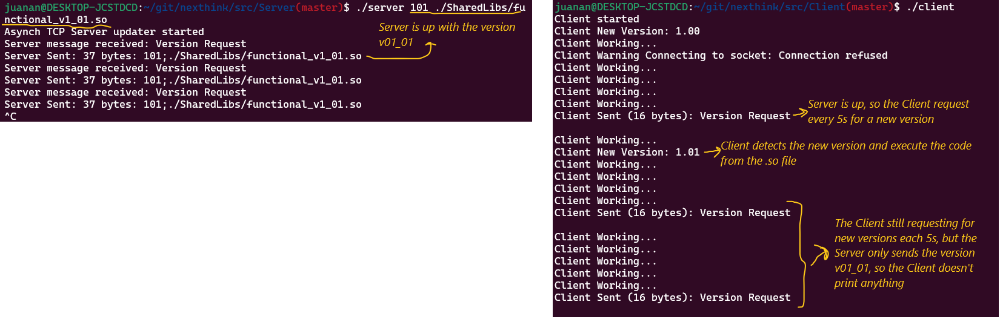
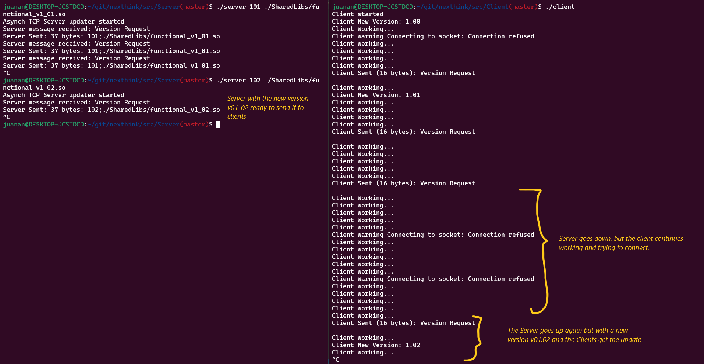
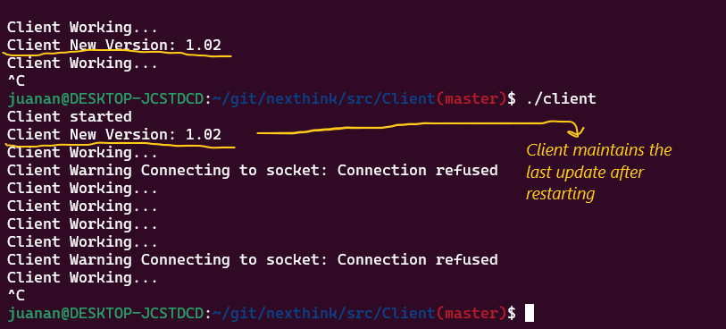

# Client - Server updater exercise

Implementation of a Client - Server application in Linux (Tested in Ubuntu 20.04 using wsl2).

## Initial Requirements

The client application:

* Is a console application made up of two parts:
    1. A simple functional part that just prints its version to the console whenever the application is launched or after an update
    2. A part that is able to establish a connection with the update service and update the functional part to the latest version
* Should be able to update the functional code without restarting the application process.

The server application:

* Implements an update service
* Should be able to accept a new version of the client application functional part and send it to the client application.

## Additional Requirements

* The Client should save his current version and path to the shared lib in order to maintain the newest version if the application is closed and executed again.

## Solution

### Client App

The client is an application that runs the functional code in a thread. This functional code is a function, loaded from a shared library, that returns the current version of the client.
While running the functional part, the client also request if there is a new version every 5 seconds to server. If the server is down, the client continues trying to connect each 5 seconds without failing. Once the server is up and accepting connections, the client sends a message requesting a new version. The Server replies with the last version that he has. The message of the server follows this format: version;path_to_shared_lib_version
Then the client checks if the version is newer to his current version.
If not, it doesn't update anything and continues with it main cycle of running and requesting.
If the version is newer to the current, then the client try to read the path of the new version shared library and loads the function.
The Client then saves the new version and path in a file for future executions.



### Server App

The server is an application that needs as input the newest version in int format (Example: v1.00 is 100, v01.02 is 102) and the path of the shared lib. It accepts clients and waits until a message from them. When this happens, he sends the message of the newest version with the format: version;path_to_shared_lib_version.
After that, it waits until new requests. In order to update the newest version in the server, you need to shut down it (ctrl+C) and then execute it again with the new version and path as input. The server has the functionality of checking if the message generated in the main.cpp has the correct format, and sends a default message if it doesn't match the format.




## External Libs to the std used

### Boost

```sh
sudo apt install libboost-dev
sudo apt install libboost-all-dev
```

## Compile

In order to compile it successfully, you will need to have a "bin" directory and inside it a "SharedLibs" directory. If you clone this repo, you wouldn't need to create these directories.

```sh
source utils.sh
buildClient
buildSharedLibs
buildServer
```

## Execution

Open two shells, one for the server and the other for the client.

### Client

```sh
# Go to your bin directory
cd bin
./client
```

### Server

```sh
# Go to your bin directory
cd bin

# Execute server with the version and the path to the shared lib
./server 100 ./SharedLibs/functional_v1_00.so

# You can ctrl+C and send another different version
./server 101 ./SharedLibs/functional_v1_01.so
```

## Example of execution

1. Client running without server. At the startup it prints his current version and then try to connect to the server.

2. Then the server starts and the client gets the connection and starts to request a new version. The Server sends the newest version and the client gets it. As the version is newer, the client prints the new version and continues his main cycle.

3. The Server goes down because we want to load a new client version. While the server is down, the client continues his cycle, trying to get a connection. Then the server goes up with a new version and the client is updated.

4. The Client goes down and we execute it again. In the new execution, he maintains the last version.


## Future Improvements

* Instead of having the shared lib .so file in the machine, the Server could send an URL where the .so file is uploaded, so that the client downloads it. In my opinion, the current implementation is enough for resolving the exercise, but the proposed approach could be similar to an operational service, where the final clients don't have the new updated .so files.

* Client:

  * Catch the signal of SIGINT in order to call TCPClient destructor so that the dclose is called to avoid memory leaks
* Server:

  * Following a similar approach as how the TCPClient works with threads, manage to get the new version in real time from console or file, without the need of shutting down the server and then executing with different parameters to send an updated version
* Use Makefile, CMake or meson to manage better the compilation and generation of the bin files

* Use dockers for avoiding installing the external dependencies in the developer machine.

* The code of TCPConnection and TCPClient could be refactored using OOP and Inheritance.

* Use googletest for unit testing the code. I have tested a lot of functional cases, but with unit tests it should be more maintainable for future improvements.

## References

* For linux shared libraries management <https://tldp.org/HOWTO/html_single/C++-dlopen/#externC>
* For compile shared libraries in Linux <https://stackoverflow.com/questions/496664/c-dynamic-shared-library-on-linux>
* For boost TCP connections <https://www.boost.org/doc/libs/1_62_0/doc/html/boost_asio/examples/cpp11_examples.html>
* For using PlantUML <https://plantuml.com/es/sequence-diagram>
* For showing multithread in UML <https://stackoverflow.com/questions/1643733/how-to-illustrate-multiple-threads-in-sequence-diagram>
